*A facial emotion recognition system built with deep convolutional neural network*

## Table of Contents
1. [Motivation](#1-motivation)
2. [The Database](#2-the-database)
3. [The Model](#3-the-model)
	* [3.1 Input Layer](#input-layer)
	* [3.2 Convolutional Layers](#convolutional-layers)  
	* [3.3 Dense Layers](#dense-layers)
	* [3.4 Output Layer](#output-layer)
	* [3.5 Challenges](#challenges)
4. [Model Validation](#4-model-validation)
5. [Applications](#5-applications) 
	* [5.1 RESTful API](#RESTful-API)
	* [5.2 Interactive Web App](#interactive-web-app)
	* [5.3 Real-Time Video Prediction](#real-time-video-prediction)
6. [Next Steps](#6-next-steps)
7. [About the Author](#7-about-the-author)
8. [References](#8-references)

## 1 Motivation
Most of us would agree that human facial expressions can be classified into roughly 7 basic emotions: happy, sad, surprise, fear, anger, disgust, and neutral. Our facial emotions are expressed through activation of specific sets of facial muscles. These sometimes subtle, yet complex, signals in an expression often contain an abundant amount of information about the state of mind. Through facial emotion recognition, we are able to gauge the **true effects** content and services have on the audience/users in a easy and low-cost way. For example, a content provider could use these metrics to measure **user engagement**, instead of sending out surveys. The medical community can benefit from monitoring facial emotions to evaluate the **condition of a patient** in order to provide better services.

> **“2016 is the year when machines learn to grasp human emotions”**
--Andrew Moore, the dean of computer science at Carnegie Mellon. 

Human beings are well-trained in reading the emotions of others, in fact, at just 14 months old, babies can already tell the difference between happy and sad. **But can computers do a better job than humans in accessing emotional states?** To answer the question, I designed a deep learning neural network that gives machines the ability to make inferences about our emotional states. In other words, I give them eyes to see what we see.

## 2 The Database
The dataset I used for training the model is from a Kaggle Facial Expression Recognition Challenge a few years back (FER2013). It comprises a total of 35887 pre-cropped, 48-by-48-pixel grayscale images of faces each labeled with one of the 7 emotion classes: anger, disgust, fear, happiness, sadness, surprise, and neutral. 

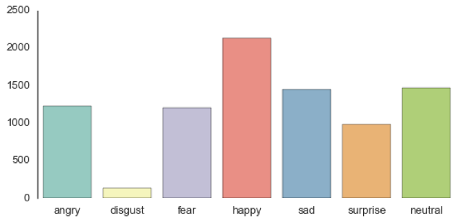
#####Figure 1. An overview of FER2013.

As I was exploring the dataset, I discovered an imbalance of the “disgust” class (only 113 samples) compared to many samples of other classes. I decided to merge disgust into anger given that they both represent similar sentiment. To prevent testing set leakage, I built a data generator `fer2013datagen.py` that can easily separate training and hold-out set to different files. I used 28709 labeled faces as the training set and held out the rest (3589+3589) for after-training validation. The resulting is a 6-class, balanced dataset, shown in Figure x, that contains angry, fear, happy, sad, surprise, and neutral. Now we’re ready to train.

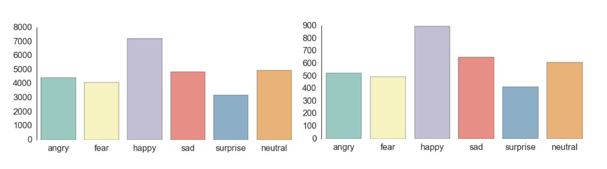
#####Figure 2. Training and validation data distribution.

## 3 The Model

#####Figure 3. Mr. Bean, the model for the model.

Deep learning is a popular technique used in computer vision. I chose convolutional neural network (CNN) layers as building blocks in creating my model architecture. CNNs are known to imitate how the human brain works on the back end when analyzing visuals. I will use a picture of Mr. Bean as an example to explain how images are fed into the model, because who doesn’t love Mr. Bean? 

A typical architecture of a convolutional neural network has an input layer, convolutional layers, dense layers (aka. fully-connected layers), and an output layer.  These are linearly stacked layers ordered in sequence. In Keras, this it is called `Sequential()` in which the layers would be built.

###3.1 Input Layer
* This layer has pre-determined, fixed dimensions, so the image must be pre-processed before it can be fed into the layer. I used OpenCV, a computer vision library, for face detection in the image. The `haar-cascade_frontalface_default.xml` in OpenCV contains pre-trained filters and uses `Adaboost` to quickly find and crop the face. 
* The cropped face is then converted into grayscale with `cv2.cvtColor` and resized to 48-by-48 pixels with `cv2.resize`. This step greatly reduces the dimensions compared to the original RGB format with three color dimensions (3, 48, 48).  The pipeline ensures every image can be fed into the input layer as a (1, 48, 48) numpy array.

###3.2 Convolutional Layers
* The numpy array gets passed into the `Convolution2D` layer where I specify the number of filters as one of the hyperparameters. The **set of filters** (aka. kernel) are non-repetitive with randomly generated weights. Each filter, (3, 3) receptive field, slides across the original image with shared weights to create a new feature map. 
*  The convolution step generates **feature maps** that represent the unique ways pixel values are enhanced, for example, edge and pattern detection. In Figure 4, a feature map is created by applying filter 1 across the entire image. Other filters are applied one after another creating a set of feature maps. 

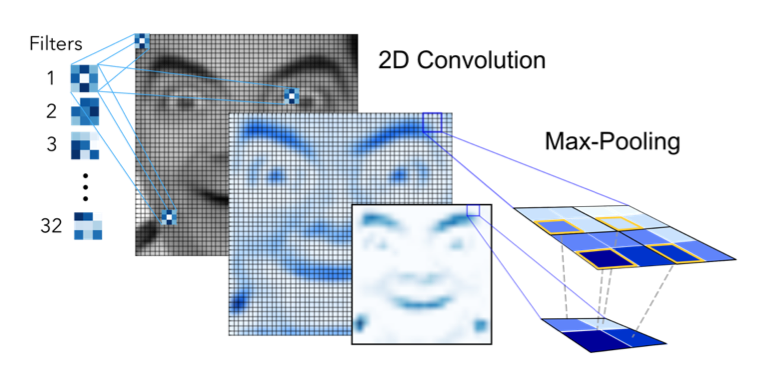
#####Figure 4. Convolution and 1st max-pooling used in the network.

* **Pooling** is a dimension reduction technique usually applied after one or several convolutional layers. It is an important step when building CNNs as adding more convolutional layers can greatly affect computation time. I used a popular method called `MaxPooling2D` that uses (2, 2) windows each time only to keep the maximum pixel value. As seen in Figure 4, max-pooling on the (2, 2) square sections across the feature map results in a dimension reduction by 4.

###3.3 Dense Layers
* The dense layer (aka fully connected layers), is inspired by the way neurons transmit signals through the brain. It has the ability to accept a large number of input features and transform features through learned weights to detect subtle patterns.
* The network can be initialized by applying random weights to the interconnected layers. These weights can then be trained by **back propagation** using labeled data. Back propagation looks at errors produced by current weights at the output and back propagating the corrections all the way to the input layer. The weights are gradually adjusted as we feed in more training data allowing the model to learn patterns.
* By tuning the hyper-parameters, such as learning rate and network density, we can control the speed of training and the complexity of the network architecture.
* Essentially, the more layers we add to the model the better it can pick up signals. However, the model also becomes increasingly prone to overfitting the training data. One method to prevent overfitting and generalize on unseen data is to apply **dropout**. Dropout randomly chooses a portion (usually less than 50%) of nodes to set their weights to zero during training. This method can effectively control the model's sensitivity to training data while maintaining the necessary complexity of the architecture.
* It is important to note that there is no specific formula to building a neural network that would work well. For different problems, it would require different network architecture and a lot of trail and errors to make improvements. You may end up with a good net architecture with experimentations over time.

###3.4 Output Layer
* Instead of using sigmoid activation function, I used **softmax** at the output layer. It represents a probability for each emotion class for a given input. Therefore, the net can tell you the detail probability composition of the emotions in the face. As later on, you will see that it is not efficient to classify human facial expression as only a single emotion. Our expressions are usually much complex and contain a mix of emotions that could be used to accurately describe the state of mind.

###3.5 Challenges
To begin with, I built a simple version of the CNN: input, convolution, dense, and output layer. As it turns out, the simple model preformed terribly. The low accuracy of 0.1500 shows that it is merely random guessing an emotion. The model is too simple to pick up the subtle details in facial expressions. This could only mean one thing…

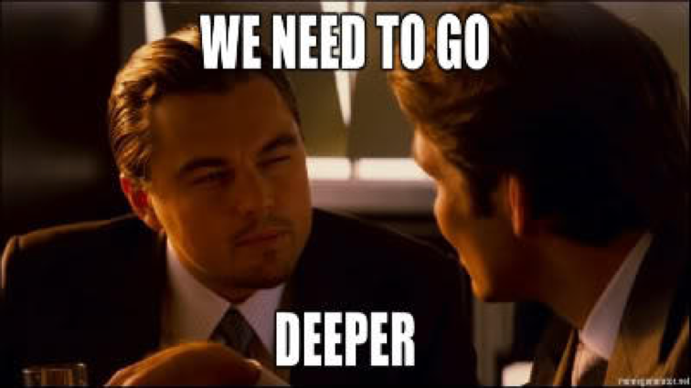

This is the where deep learning comes in. Given the pattern complexity of facial expressions, it is necessary to build with a deeper architecture in order to pick up enough signals. So I tested various net architectures that goes from complex to more complex. I played around with three components: number of convolutional layers, portions of dropout, and number of dense layers. In the end, my final net architecture was 9 layers deep in convolution with one max-pooling after every three convolution layers as seen in figure below. 

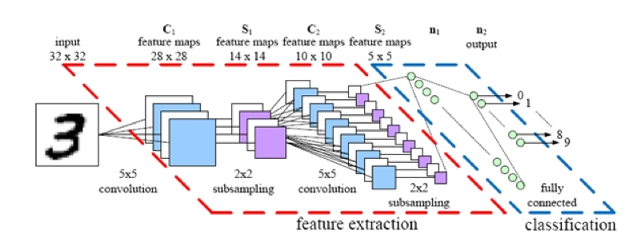
#####Figure 5. Facial Emotion Recognition CNN Architecture.

As a result, the feature maps become increasingly abstract down the pipeline when more pooling layers are added. Figure 6 and 7 gives an idea of what the machine sees in feature maps after 2nd and 3rd max-pooling. 

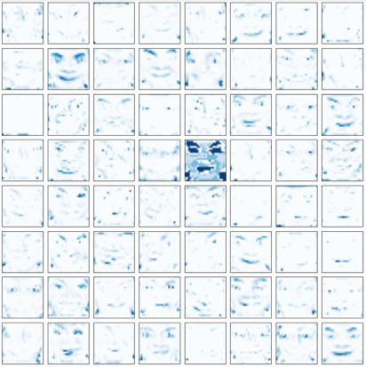
#####Figure 6. CNN (64-filter) feature maps after 2nd layer of max-pooling.

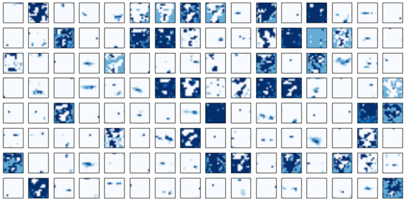
#####Figure 7. CNN (128-filter) feature maps after 3nd layer of max-pooling.

## 4 Model Validation
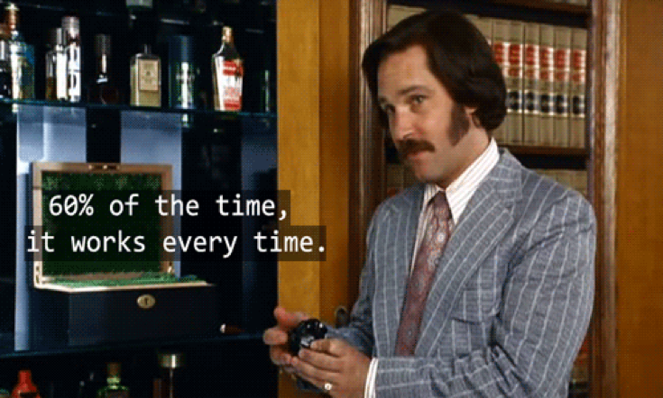

As it turns out, the final CNN had a validation accuracy of 58%. This makes a lot of sense, because it is hard to use one label to classify each facial expression. Our expressions usually consist a combination of emotions. When the model predicts incorrectly on one label, the correct label is often the second most likely emotion as in examples in Figure 8 with blue labels.

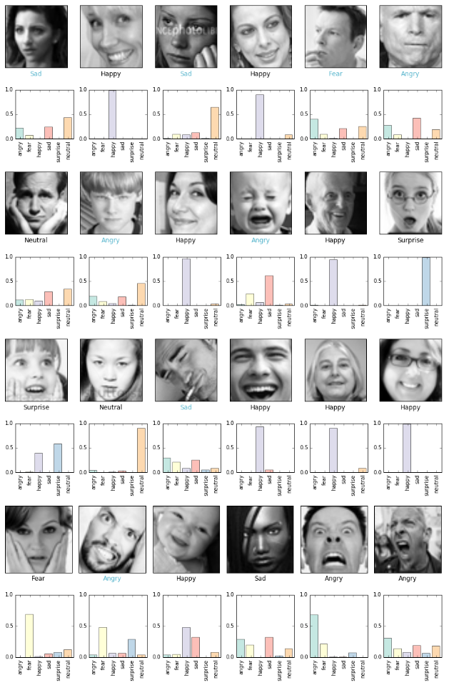
#####Figure 8. Random 24 examples in test set validation.

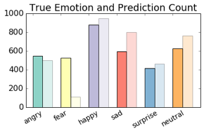
#####Figure 9. True emotion label and model prediction count on test set.

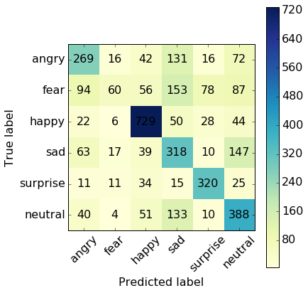
#####Figure 10. Confusion matrix for true and prediction emotion counts.

## 5 Applications

#####Figure 9. Application pipeline.

I built 3 applications around this project. 

###5.1 RESTful API
- built on AWS EC2 instance 
- with mongoDB feedback storage
- Find source code here.
- Find the API [RESTful API](http://54.227.229.33:5000/static/swagger-ui-build/index.html) Try it!
- requirements...

###5.2 Interactive Web App
- Find the app: [MemeMoji --the app](http://54.227.229.33:5000/static/FaceX/index.html) Try it!
- Find source code here [link]
- requirements...

###5.3 Real-Time Video Prediction
- Real-time emotion prediction OpenCV
- Find source code here [link]
- requirements...

## 6 Next Steps

(to be continued...)

## 7 About the Author

**Jostine Ho** is a data scientist who loves building intelligent applications and exploring the exciting possibilities using deep learning. She is interested in computer vision and automation that creates innovative solutions to real-world problems. She holds a masters degree in Petroleum & Geosystems Engineering at The University of Texas at Austin. You can find her on [LinkedIn](https://www.linkedin.com/in/jostinefho)

## 8 References

1. [Facial Emotion Recognition (FER2013) Kaggle dataset](https://www.kaggle.com/c/challenges-in-representation-learning-facial-expression-recognition-challenge/data)

2. [Andrej Karpathy's cs231n Convolutional Neural Networks for Visual Recognition](http://cs231n.github.io/convolutional-networks/)

3. Srivastava et al., 2014. *"Dropout: A Simple Way to Prevent Neural Networks from Overfitting"*, Journal of Machine Learning Research, 15:1929-1958.

4. [Facial Emotion Recognition in Real-time](http://cs231n.stanford.edu/reports2016/022_Report.pdf)
